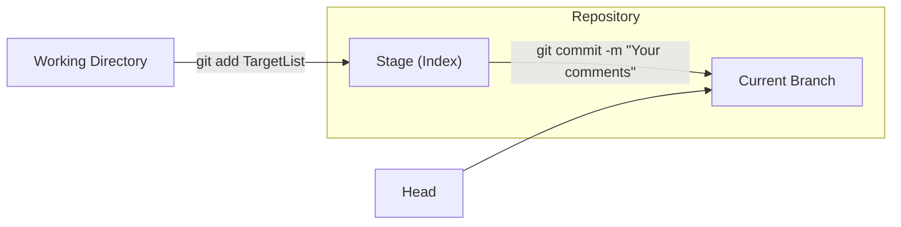

<!-- vim-markdown-toc GFM -->

- [Git](#git)
  - [Perface](#perface)
  - [Create and Initialize a Repository](#create-and-initialize-a-repository)
    - [Code](#code)
    - [The Workflow of `git add TargetList` and `git commit -m "Your comments"`](#the-workflow-of-git-add-targetlist-and-git-commit--m-your-comments)
      - [The Workflow](#the-workflow)
      - [Explanation](#explanation)
  - [Add Files to a Branch](#add-files-to-a-branch)
  - [Delete Files of a Branch](#delete-files-of-a-branch)
  - [Check the Status](#check-the-status)
  - [Discard Current Modifications](#discard-current-modifications)
  - [Check the Differences](#check-the-differences)
  - [Check the Revision History](#check-the-revision-history)
  - [Revert to the Previous Version While Keeping Current Modifications](#revert-to-the-previous-version-while-keeping-current-modifications)
  - [Revert to the Previous Version and Discard Current Modifications](#revert-to-the-previous-version-and-discard-current-modifications)
  - [Link the Local Repository to a Remote Repository](#link-the-local-repository-to-a-remote-repository)
  - [Clone a Remote Repository](#clone-a-remote-repository)
  - [Update the Local Repository form a Remote Repository](#update-the-local-repository-form-a-remote-repository)
  - [Push the Local Repository to the Remote Repository](#push-the-local-repository-to-the-remote-repository)
  - [Check Branches](#check-branches)
  - [Create a New Branch and Switch to The New Branch](#create-a-new-branch-and-switch-to-the-new-branch)
  - [Merge Another Branch into the Current Branch](#merge-another-branch-into-the-current-branch)
  - [Delete a Branch](#delete-a-branch)
  - [Stash Current Changes and Restore Previous Changes](#stash-current-changes-and-restore-previous-changes)
  - [Copy the Specific Modification from Another Branch to the Current Branch](#copy-the-specific-modification-from-another-branch-to-the-current-branch)
  - [Push the Current Branch to The Remote Repository](#push-the-current-branch-to-the-remote-repository)
  - [Reorganize the Commit History](#reorganize-the-commit-history)
  - [Tag Commits](#tag-commits)

<!-- vim-markdown-toc -->

## Git

### Perface

1. This file lists only common Git commands.
2. For a deeper understanding of Git, you should learn from a comprehensive Git tutorial.

### Create and Initialize a Repository

#### Code

```SH
cd ~
mkdir repository_name
cd repository_name
git init
### Edit lots of files.
git add TargetList
git commit -m "Your comments"
```

#### The Workflow of `git add TargetList` and `git commit -m "Your comments"`

##### The Workflow



##### Explanation

1. Working directory:
   - This is the directory where you work on your project.
   - Typically, it serves as the root directory and often contains a `.git` directory, which
     primarily includes the config file, the staging area, branches, and the head.
   - You can use the `exa` command to explore its tree structure.
2. Stage:
   - After executing the `git add TargetList` command, all changes to the files in `TargetList` are
     submitted to the staging area.
3. Current branch:
   - This refers to the branch you are currently working on in your project.
4. HEAD:
   - It is a pointer that refers to the current commit in your local repository.
   - It indicates where you are in the commit history.
   - When you make new commits, HEAD moves forward to point to the latest commit.
5. master:
   - It is typically the name of the main branch in your local repository.
   - It represents the latest commit on that branch. When you switch to the master branch, HEAD
     points to master.
6. origin/master:
   - It is a remote-tracking branch that represents the state of the master branch on the remote
     repository (usually named origin).
   - It reflects the last known state of the master branch on the remote when you last fetched or
     pulled changes.
   - It doesn't change unless you explicitly fetch or pull.
7. origin/HEAD:
   - It is a symbolic reference that points to the default branch of the origin remote repository,
     often pointing to origin/master.
   - It helps Git determine which branch to track for new clones of the repository.
8. origin
   - origin is the default name given to a remote repository when you first clone a repository or
     add a remote with the command `git remote add origin TheRemoteRepositoryLink`
   - It is a shorthand alias used to refer to that remote repository, making it easier to work with
     Git commands without typing the full URL each time.

### Add Files to a Branch

```SH
git add TargetList
git commit -m "Your comments"
```

### Delete Files of a Branch

```SH
git rm TargetList
git commit -m "Your comments"
```

### Check the Status

```SH
git status
```

### Discard Current Modifications

```SH
git checkout -- TargetList
```

### Check the Differences

```SH
git log -Number(How many, Optional)
git diff CommitNumber(A sequence of number, Optional) TargetList(Optional)
```

### Check the Revision History

```SH
git log -Number(How many, Optional)
git show CommitNumber(A sequence of number, Optional) TargetList(Optional)
```

### Revert to the Previous Version While Keeping Current Modifications

```SH
git log -Number(How many, Optional)
git reset CommitNumber(A sequence of number) TargetList(Optional)
```

### Revert to the Previous Version and Discard Current Modifications

```SH
git log -Number(How many, Optional)
git reset --hard CommitNumber(A sequence of number) TargetList(Optional)
```

### Link the Local Repository to a Remote Repository

```SH
git remote add origin TheRemoteRepositoryLink # Connect the local repository to the remote one.
git remote -v # Verify the remote link.
git push -u origin CurrentBranch # Push local changes to the remote.
```

### Clone a Remote Repository

```SH
git clone TheRemoteRepositoryLink
```

```SH
// If the remote repository is too large to clone successfully, use the following commands.
git clone TheRemoteRepositoryLink --depth 1
cd TheRemoteRepositoryName
git fetch --unshallow
```

### Update the Local Repository form a Remote Repository

```SH
git pull
```

### Push the Local Repository to the Remote Repository

```SH
git push
```

```SH
git push -f # Force
```

### Check Branches

```SH
git branch
```

### Create a New Branch and Switch to The New Branch

```SH
# Old method
git checkout -b ANewBranch # Create and swithc
```

```SH
# Old method
git branch ANewBranch # Create
git checkout ANewBranch # Switch
```

```SH
# New method
git switch -c ANewBranch # Create and swithc
```

```SH
# New method
git branch ANewBranch # Create
git switch ANewBranch # Switch
```

### Merge Another Branch into the Current Branch

```SH
git merge AnotherBranch
```

```SH
git merge --no-ff -m "Your comments" AnotherBranch # Ban fast-forward
# In Git, "fast-forward" is a type of merge operation that happens when there is no divergent history
# between the current branch and the branch you're merging.
```

### Delete a Branch

```SH
git branch -d ABranch
```

```SH
git branch -D ABranch # Force
```

### Stash Current Changes and Restore Previous Changes

```SH
git stash # Stash current changes
```

```SH
git stash list # List all stashes
```

```SH
# The structure of the stash is a stack.
git stash pop # Restore the recent stash and delete it in the stash.
```

```SH
git stash list # List all stashes
git stash apply stash@{number}(Optional) # Restore the recent stash
git stash drop stash@{number}(Optional) # Delete it in the stash.
# The larger the number, the earlier the stash.
```

### Copy the Specific Modification from Another Branch to the Current Branch

```SH
git switch AnotherBranch
git log # Find the specific Modification
git switch CurrentBranch
git cherry-pick CommitNumber
```

### Push the Current Branch to The Remote Repository

```SH
git push origin CurrentBranch
```

### Reorganize the Commit History

```SH
git rebase
```

### Tag Commits

```SH
git tag #Check tags
```

```SH
git tag TagName CommitNumber(Optional)
# If you tag CommitNumber with TagName, TagName can replace CommitNumber in git commands that require it.
```
